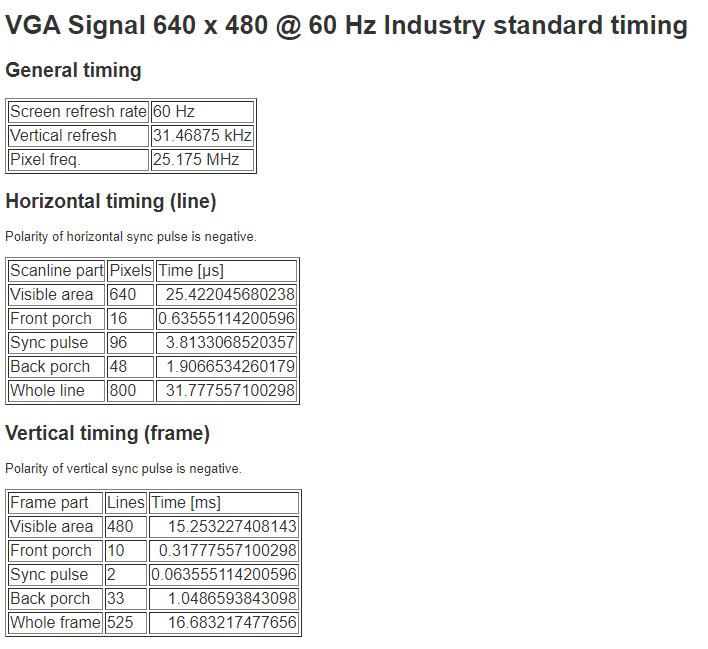
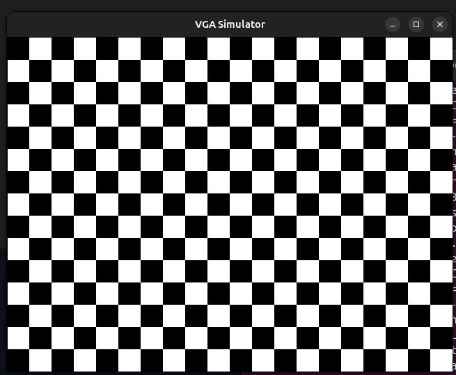

# VGA Signal Generator in Verilog

VGA technology works by transmitting a video signal that includes separate red, green, and blue color signals along with horizontal and vertical sync signals from devices like computers and DVD players to displays such as monitors and projectors.

---

## Table of Contents
1. Introduction
2. VGA Standard
3. System Overview
4. Module Explanation
5. Simulation (Manual)

---

## 1. Introduction

This project implements a minimal VGA graphics system in Verilog.  
It generates a 640×480 @60Hz VGA signal and displays different VGA test patterns.

The image is not stored in memory.  
Instead, it is generated pixel by pixel in real time using simple logic.

The design consists of three modules connected in sequence:

display module → vga_controller → graphics → VGA output

Each module performs a specific role in generating the video signal.

---

## 2. VGA Standard

A VGA monitor does not display the whole image at once.  
It draws the screen pixel by pixel using a process called raster scanning.

The scanning sequence is:

1. Start at the top-left pixel.
2. Move left to right across the row.
3. When the row ends, move down one line.
4. Repeat until the bottom of the screen.

### Scan pattern

(0,0) → (1,0) → (2,0) → ... → (639,0)  
↓  
(0,1) → (1,1) → (2,1) → ... → (639,1)  
↓  
(0,2) → ...

Each pixel is generated on every clock cycle.

---

### VGA Timing (640×480 @60Hz)




### Total pixels per frame

800 × 525 = 420,000 pixels

At 60 frames per second:

420,000 × 60 ≈ 25.175 MHz pixel clock

So the design operates at approximately a 25 MHz pixel clock.

---

## 3. System Overview

The system generates the video signal using three modules:

vga_controller → graphics → display → VGA output

For every clock cycle:

1. The VGA controller produces the current pixel position.
2. The graphics module determines the pixel color.
3. The display module forwards the signals to the output.

This process repeats continuously to form the image.

---
## 4. Module Explanation

### vga_controller

This module generates all VGA timing signals.

It produces:

- Horizontal pixel coordinate (`coord_x`)
- Vertical pixel coordinate (`coord_y`)
- Horizontal sync (`hsync`)
- Vertical sync (`vsync`)
- Active display signal (`active_area`)

It uses two counters:

- Horizontal counter: counts from 0 to 799  
  - Visible region: 0 to 639
- Vertical counter: counts from 0 to 524  
  - Visible region: 0 to 479

The `active_area` signal indicates whether the current pixel is inside the visible screen:

- `active_area = 1` → visible pixel  
- `active_area = 0` → blanking region  

Graphics are rendered only when `active_area` is high.

---

### graphics module

This module determines the color of each pixel.

Inputs:

- `coord_x`
- `coord_y`
- `active_area`

Output:

- `rgb`

Different versions of the `graphics` module can be used to generate
different patterns or animations on the VGA screen.

---

### display module

This is the top-level module.

It connects:

vga_controller → graphics → VGA outputs

It is responsible only for wiring the modules together and forwarding
the RGB and sync signals to the output.

---

## 5. Simulation (Manual)

### Compile and Run

Install everything required to run this simulation on Ubuntu Linux: 

```bash
sudo apt-get update
sudo apt-get install build-essential
sudo apt-get install verilator
sudo apt-get install libglu1-mesa-dev freeglut3-dev mesa-common-dev
```
Open terminal in the rtl folder and compile design :

```
verilator -Wall -Wno-UNUSEDSIGNAL -Wno-UNUSEDPARAM -Wno-SYNCASYNCNET \
--cc --exe src/simulator.cpp display.v graphics.v vga_controller.v \
-LDFLAGS -lglut -LDFLAGS -lGLU -LDFLAGS -lGL
```

Build the executable:
```
make -j -C obj_dir -f Vdisplay.mk Vdisplay
```
Run the simulation:
```
obj_dir/Vdisplay
```

## Simulation Result

<div align="center">

<table>
<tr>
<td align="center">

**VGA Output**  
<br>


</td>

<td width="80"></td>

<td align="center">

**Simulation Video**  
<br>


</td>
</tr>
</table>

</div>


---

## Other Graphics Examples 
For a simple guide on how to change screen patterns, 
see the [RTL Folder Guide](rtl/README.md).

## Important Note (Very Important)

Do not keep this project inside a folder that has spaces in its name.

If there are spaces, the simulation will fail with an error like:

Unsupported: GNU Make cannot build in directories containing spaces

Example:
```
Wrong folder path (spaces are highlighted): ~/Downloads/VGA Project/ rtl
                                                           ^        ^
                                                         space    space
```
Correct folder path (no spaces):
~/Downloads/vga_project/rtl

How to fix it:

1. Go to the Downloads folder:
   cd ~/Downloads

2. Rename the folder to remove spaces:
   mv "VGA Project" vga_project

3. Go back to the project:
   cd vga_project/rtl

Now run the simulation again.
